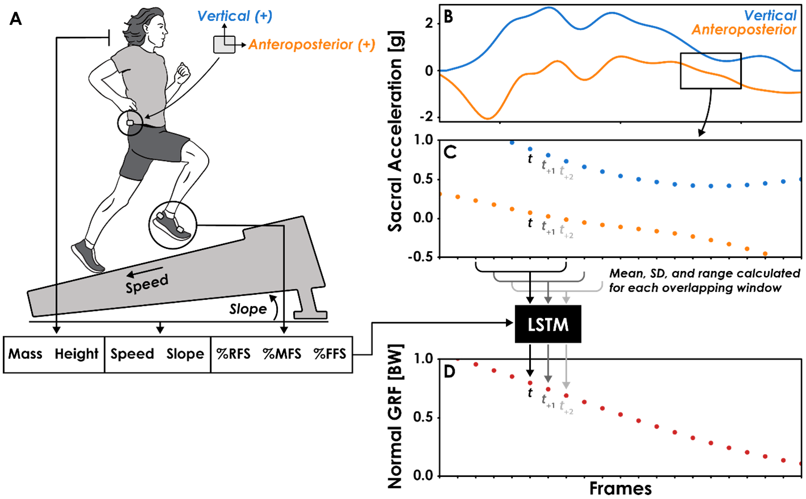

# Predicting continuous ground reaction forces from accelerometers during uphill and downhill running: A recurrent neural network solution

This repository contains an example of how a Recurrent Neural Network (RNN) can be used to predict ground reaction
force (GRF) data from accelerometer data during running. The model files and supporting data are archived via [Zenodo](https://zenodo.org/record/4995574).
Please cite the associated publication if using code or data from this repository:

[Predicting continuous ground reaction forces from accelerometers during uphill and downhill running: A recurrent neural network solution. *bioRxiv.*](https://www.biorxiv.org/content/10.1101/2021.03.17.435901v1.article-metrics)

## Repository Contents
- `data/`: Contains example accelerometer data, GRF data, condition/demographic data, and RNN model file. 
- `Train_RNN.ipynb`: Notebook example of how to prepare data and train an RNN to predict GRFs from accelerometer data.
If you're going to run this notebook using [Google Colab](https://colab.research.google.com/) (recommended), make sure 
you utilize their GPU Runtime Type. You will need to adjust the path to `data/` depending on how files are uploaded in
Google Colab.
- `pre_processing.py`: Some functions used in `Train_RNN.ipynb`.

## Feature Engineering 

RNNs require time series data to be divided into subsequences instead of feeding it the whole time series at once. I took a 
many-to-one approach, where *many* frames of the accelerometer signal were used to predict *one* frame of the GRF signal:

Window size can have interesting effects on prediction accuracy. If the window is only 1 frame, the model is only 
using one frame's worth of information to make the prediction. This can lead to poor predictions if acceleration and
GRF data don't match up consistently across running speeds or slopes. However, if the window size is so large, say the 
entire length of stance phase, then there's too much data to sift through just to predict one frame. I found that a 
window size of 6 frames (12 ms at 500 Hz) worked well for predicting GRFs during running.

In addition to window size, I  had to decide on the number of features to be calculated from each window of accelerometer
data. On the simple side of things, the features could have been 6 frames of the signal itself. On the more complex
side, there are python packages that could have generated >1,000 features from each 6-frame window. I started with many
features and realized that not many signal features were needed to achieve satisfactory accuracy while minimizing 
computational costs. I calculated the mean, SD, and range for each 6-frame window of both the Anteroposterior (AP) axis 
and Vertical axis of the sacrum accelerometer data, a total of 6 features. In addition to these features, I included 
information about the condition and runner,
1. Runner Height (cm)
1. Runner Mass (kg)
1. Running Velocity (m/s)
1. Running Slope (degrees)
1. Foot strike Pattern (% of steps in trial classified as Forefoot, Midfoot, or Rearfoot strike)

for a total of 13 features: (3 features from the AP accelerometer data, 3 features from the vertical accelerometer 
data, and 7 discrete features).

## RNN vs MLP
The benefit of using RNNs is that the input can be of variable lengths! Even though the network in this repository
was trained on signals that were *n* seconds long, it will work on longer or shorter signals, as long as the number of 
features and size of windows are the same. This is advantageous over multilayer perceptrons (MLPs) that are used to 
predict the whole time series at once. The input signal length must be consistent during training and inference, so 
that's why it's common to normalize accelerometer and GRF data to 100% stance phase and process each stance phase separately. 
This approach requires preliminary stance phase identification and doesn't allow for calculation of temporal variables 
like contact time, swing time, step frequency, etc. 

## Questions?
[Open an issue](https://github.com/alcantarar/Recurrent_GRF_Prediction/issues/new) if you have a question or if 
something is broken. 
